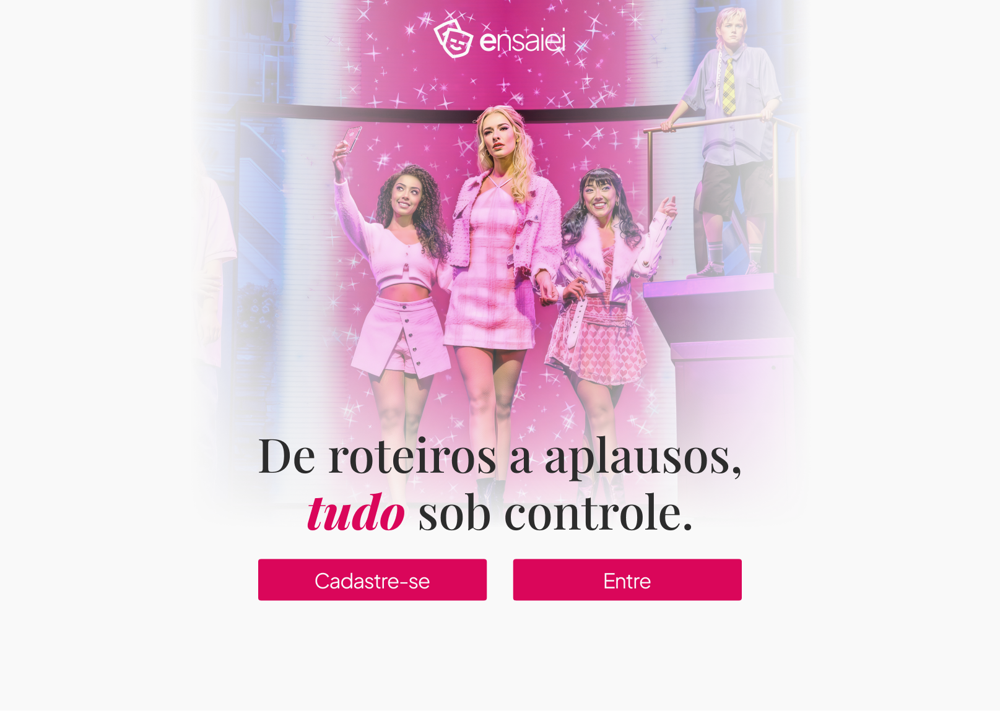

# 🎭 Ensaiei




## 📑 Sumário
- [Visão Geral](#visão-geral)
- [Base URL](#base-url)
- [Endpoints](#endpoints)
  - [Usuários](#usuários)
  - [Eventos](#eventos)
  - [Atrações](#atrações)
- [Estrutura do Projeto](#estrutura-do-projeto)
- [Banco de Dados](#banco-de-dados)
  - [Tabela `users`](#tabela-users)
  - [Tabela `events`](#tabela-events)
  - [Tabela `attractions`](#tabela-attractions)
  - [Tabela `attractions_performers`](#tabela-attractions_performers)
- [Respostas da API](#respostas-da-api)
- [Requisitos](#requisitos)

---

## 📖 Visão Geral

API RESTful para gerenciamento de eventos e suas atrações, permitindo que usuários possam criar, visualizar, atualizar e excluir eventos e atrações.

---

## 🌐 Base URL

```
http://localhost/ensaiei/api
```

---

## 🔗 Endpoints

### 👤 Usuários

#### 🔐 Login
```
POST /users/login
```
Autentica um usuário no sistema.

#### 📋 Listar Usuários
```
GET /users
```
Retorna todos os usuários cadastrados.

#### 🔍 Buscar Usuário por Username
```
GET /users/{username}
```
Retorna informações de um usuário específico.

#### ➕ Criar Usuário
```
POST /users/add
```
Cadastra um novo usuário.

#### ✏️ Atualizar Usuário
```
PUT /users/update
```
Atualiza informações do usuário.

#### ❌ Deletar Usuário
```
DELETE /users/delete
```
Remove um usuário do sistema.

---

### 🎫 Eventos

#### 📋 Listar Eventos
```
GET /event
```
Retorna todos os eventos.

#### 🔍 Buscar Evento por ID
```
GET /event/{id}
```
Retorna detalhes de um evento específico.

#### ➕ Criar Evento
```
POST /event/add
```
**Campos obrigatórios:**
- title
- description
- location
- startDate
- endDate
- startTime
- endTime

#### ✏️ Atualizar Evento
```
PUT /event/update/{id}
```
Atualiza um evento existente.

#### ❌ Deletar Evento
```
DELETE /event/delete/{id}
```
Remove um evento do sistema.

---

### 🎭 Atrações

#### 🔍 Buscar Atração por ID
```
GET /attraction/{id}
```
Retorna detalhes de uma atração específica.

#### 📋 Listar Atrações por Evento
```
GET /attraction/event/{eventId}
```
Lista todas as atrações de um evento.

#### 🎯 Listar Atrações por Evento e Tipo
```
GET /attraction/event/{eventId}/type/{type}
```
Filtra atrações de um evento por tipo.

#### ➕ Criar Atração
```
POST /attraction/{eventId}/add
```
**Campos obrigatórios:**
- name  
- date  
- startTime  
- endTime  
- specificLocation

#### ✏️ Atualizar Atração
```
PUT /attraction/update/{id}
```
Atualiza uma atração existente.

#### ❌ Deletar Atração
```
DELETE /attraction/delete/{id}
```
Remove uma atração do sistema.

---

## 📁 Estrutura do Projeto

```
ensaiei/
│
├── api/
│   └── index.php               # Ponto de entrada da API
│
├── source/
│   ├── Models/                 # Modelos
│   │   ├── User.php
│   │   ├── Event.php
│   │   └── Attraction.php
│   │
│   ├── WebService/             # Controladores
│   │   ├── Api.php
│   │   ├── Users.php
│   │   ├── Events.php
│   │   └── Attractions.php
│   │
│   └── Enums/                  # Enumerações
│       └── Type.php            # Tipos de atrações
│       └── Role.php            # Tipos de usuários
│
├── vendor/                     # Dependências (Composer)
│
└── database/
    └── db.sql                  # Script SQL com estrutura do banco
```

---

## 🗃️ Banco de Dados

### 🔸 Tabela `users`

| Campo     | Tipo          | Descrição                        |
|-----------|---------------|----------------------------------|
| id        | INT           | Chave primária, auto incremento |
| name      | VARCHAR(255)  | Nome do usuário                 |
| email     | VARCHAR(255)  | Email do usuário                |
| password  | VARCHAR(255)  | Senha criptografada             |
| photo     | VARCHAR(255)  | URL da foto de perfil           |
| username  | VARCHAR(60)   | Nome de usuário único           |
| bio       | VARCHAR(300)  | Biografia do usuário            |
| role      | ENUM          | 'ADMIN' ou 'STANDARD'           |
| deleted   | BOOLEAN       | Flag de exclusão lógica         |

---

### 🔸 Tabela `events`

| Campo         | Tipo            | Descrição                        |
|---------------|-----------------|----------------------------------|
| id            | INT             | Chave primária, auto incremento |
| title         | VARCHAR(200)    | Título do evento                |
| description   | TEXT            | Descrição do evento             |
| location      | VARCHAR(255)    | Local do evento                 |
| latitude      | DECIMAL(10,8)   | Latitude                        |
| longitude     | DECIMAL(11,8)   | Longitude                       |
| startDatetime | DATETIME        | Início                          |
| endDatetime   | DATETIME        | Término                         |
| deleted       | BOOLEAN         | Flag de exclusão lógica         |
| organizerId   | INT             | FK para users.id                |

---

### 🔸 Tabela `attractions`

| Campo            | Tipo           | Descrição                        |
|------------------|----------------|----------------------------------|
| id               | INT            | Chave primária, auto incremento |
| name             | VARCHAR(255)   | Nome da atração                 |
| type             | ENUM           | 'MUSIC', 'VISUAL', 'THEATER', 'DANCE', 'CINEMA', 'OTHER' |
| eventId          | INT            | FK para events.id               |
| startDatetime    | DATETIME       | Início da atração               |
| endDatetime      | DATETIME       | Término da atração              |
| specificLocation | VARCHAR(255)   | Local específico                |
| deleted          | BOOLEAN        | Flag de exclusão lógica         |

---

### 🔸 Tabela `attractions_performers`

| Campo        | Tipo | Descrição                   |
|--------------|------|-----------------------------|
| id           | INT  | Chave primária              |
| attractionId | INT  | FK para attractions.id      |
| userId       | INT  | FK para users.id            |

---

## 📦 Respostas da API

Todas as respostas seguem o padrão JSON:

```json
{
    "code": 200,
    "status": "success",
    "message": "Descrição da operação",
    "data": {}
}
```

### 🔢 Códigos de Status

| Código | Descrição              |
|--------|------------------------|
| 200    | Sucesso                |
| 201    | Criado com sucesso     |
| 400    | Requisição inválida    |
| 401    | Não autorizado         |
| 403    | Acesso proibido        |
| 404    | Não encontrado         |
| 500    | Erro interno do servidor |

---

## ⚙️ Requisitos

### 🔧 Sistema
- Servidor Web (Apache ou Nginx)
- PHP 8.1 ou superior
- MySQL 5.7 ou superior

### 📦 Extensões PHP Necessárias
- `PDO`
- `PDO_MYSQL`
- `JSON`

### 📚 Dependências
- **[CoffeeCode Router](https://github.com/robsonvleite/router)**: Gerenciamento de rotas da API

### 🔐 Controle de Acesso
- CORS habilitado para todas as origens
- Métodos permitidos: `GET`, `POST`, `PUT`, `DELETE`, `OPTIONS`
- Headers permitidos: todos
